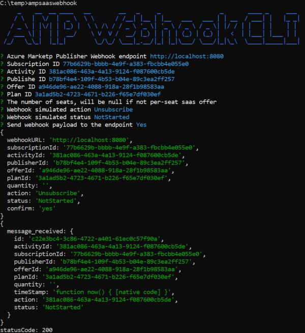

# ampsaaswebhook


This is a command line to help Azure Marketplace Publishers test the Azure Marketplace Webhook API endpoints.  Information about the webhook implementation can be found [here](https://docs.microsoft.com/en-us/azure/marketplace/partner-center-portal/pc-saas-fulfillment-api-v2#implementing-a-webhook-on-the-saas-service).



## Sample AMP Payload

``` json
{
  "id": "<this is a GUID operation id, you can call operations API with this to get status>",
  "activityId": "<this is a Guid correlation id>",
  "subscriptionId": "<Guid to uniquely identify this resource>",
  "publisherId": "<this is the publisher's name>",
  "offerId": "<this is the offer name>",
  "planId": "<this is the plan id>",
  "quantity": "<the number of seats, will be null if not per-seat saas offer>",
  "timeStamp": "2019-04-15T20:17:31.7350641Z",
  "action": "Unsubscribe",
  "status": "NotStarted"  
}
```

## Requirement

- [NodeJS](https://nodejs.org/)

## Installation

Use the following command to install the tool from the Node Package Management Service

``` bash
# npm install -g ampsaaswebhook
```

## Execution

Once installed the following command will start the cli.

``` bash
# ampsaaswebhook
```

## Tool Development and Testing

I am using the VS Code container development experience.  There is .dev container that has the tools and dependencies installed to facilitate development.  You can download it [here](https://marketplace.visualstudio.com/items?itemName=ms-vscode-remote.remote-containers) and use the .devcontainer folder to open the container environment.

The test server can be run using the following:

``` bash
npm run-script server
```

on a second terminal you can run the following npm cli:

``` bash
npm start
```


## Tool Publishing to NPM

``` bash
npm version 1.0.x
npm publish
```
